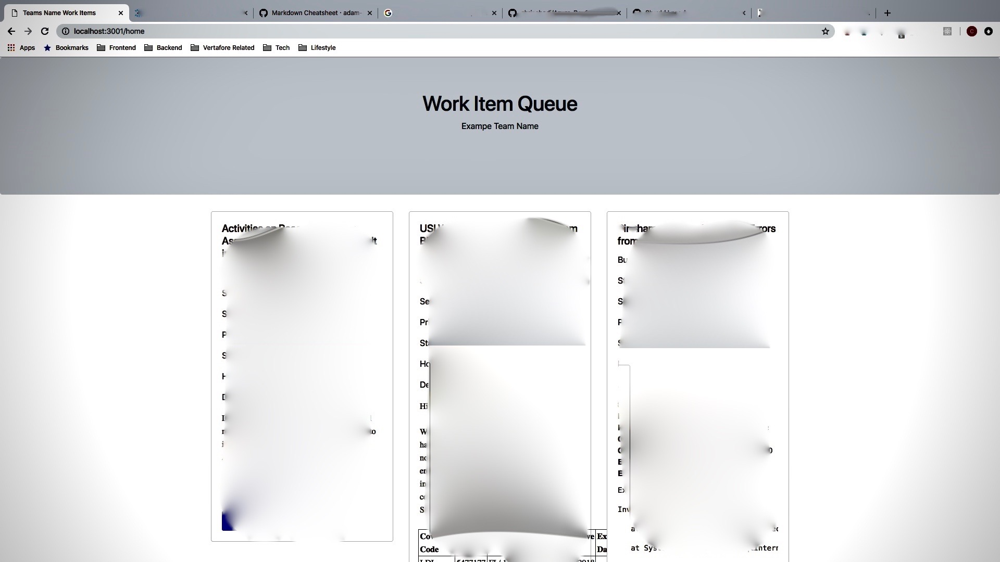

# Documentation
This application uses Auzure DevOps(formally know as VSTS) api to display Work Items from Microsofts Azure Dev Ops.

## In particular
This Project utilizes an Express backend, a redis Database, and bootstrap.
It leverages the azure-dev-ops-node-api functionality, axios, and redis to grab and store work Items locally and exposes a Development Teams 'in progress bugs', allowing for current and up-to-date progress reports.



# Project Structure
  * server.js - backend code running on port 3000. deals with redis db
  * front.js - makes calls to 3001, uses axios to request backend data
  * front.html - front end html and css, using bootstrap that displays the workItems
  * functionality.js - javascript code that is embedded in html in order to populate workitems
  * config.json - config file that specifies port and required information for azure-dev-ops-node-api 


# Getting Started
1. CLone Repo
2. Download and start Redis Server 
3. Get Your personal Access token, along with your Organizational Url from your Azure DevOps team
4. create a config.json and populate it 
```json
{
    "development": {
        "config_id": "development",
        "app_name": "Azure Dev Ops Work Item View",
        "app_desc": "my app desc",
        "port": 3000,
        "organization_url":organizationalUrl,
        "token":generatedPersonalAccessToken
    }

}

```

5. Yarn install yarn packages 
6. yarn start to run front-end and node express.js backend

## Moving Forward
Do take a look into Wiql (Microsoft's Work Item Query Language) so you can query the correct Work Items that your team require to be viewed.
